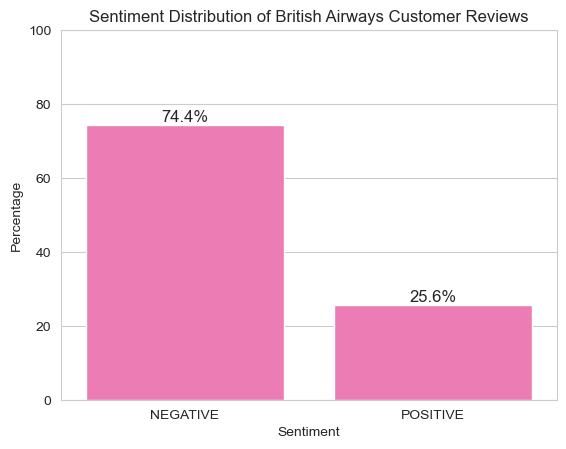

# Customer-Reviews-Analysis

### Introduction

This project aims to identify the main topics behind the negative reviews of British Airways using webscraping, sentiment analysis, and topic modeling techniques. We have used Python programming language to extract customer reviews of British Airways from the Airline Quality website using web scraping techniques. Then we have performed sentiment analysis on these reviews to identify the negative ones. Finally, we have used BERTopic library to cluster these negative reviews into different topics.

### Dataset

Dataset

The dataset for this project was obtained by scraping customer reviews for British Airways from the Airline Quality website. We collected reviews  resulting in a dataset of approximately 10,000 reviews.

To label the reviews as positive or negative, we used the Hugging Face sentiment predictor. This is a pre-trained NLP model that can predict the sentiment of a text as either positive or negative. We used this model to label the reviews as positive or negative based on the predicted sentiment score.

After labeling the reviews, we found that approximately 74% of them were negative. We then used topic modeling techniques to identify the main topics for the negative reviews. For this, we used the BERTopic package, which is an extension of the Latent Dirichlet Allocation (LDA) algorithm that uses BERT embeddings to represent the documents.

### Libraries Used

    BeautifulSoup4: to extract data from HTML and XML files
    Pandas: to work with data in a tabular form
    NLTK: to perform natural language processing tasks such as tokenization and stopword removal
    TextBlob: to perform sentiment analysis on the reviews
    BERTopic: to perform topic modeling on the negative reviews
    Matplotlib and Seaborn: to visualize the results

### EDA

<h3>Sentiment Distribution of British Airways Customer Reviews</h3>

<h3>Frequency distribution of the different words </h3>

### Modelling

Conclusion

This project has shown how webscraping, sentiment analysis, and topic modeling can be used to extract insights from customer reviews. By applying these techniques to negative reviews of British Airways, we were able to identify the main topics behind the negative feedback. These insights can be used by the airline to improve its customer service and overall customer experience.